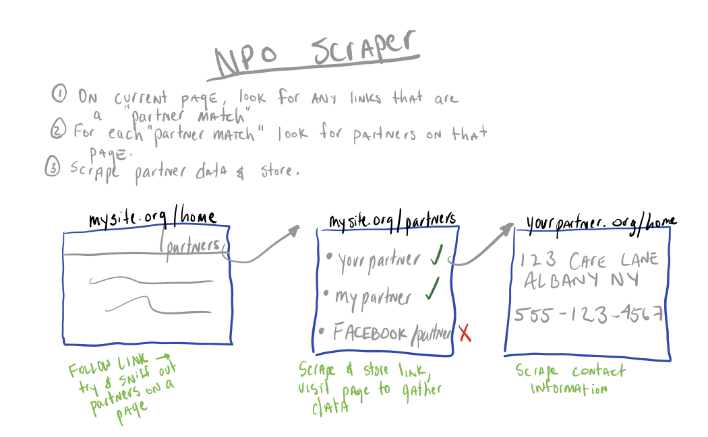

On the [last post][1] I discussed my mess of a Django project. Things are at a bit of standstill with
that project at the moment.


In the meantime, I wanted to discuss my experience with using [scrapy][4].

As my undergraduate career here at [UAlbany][2] is coming to a close — with hopes of continuing with
graduate studies — I wanted to get involved with [research][5] in our computer science department. I was
contacted by one of the [professors][6] with an idea and got to work.

### The Idea  
Create a network of non-profit organizations (NPOs) within the schools greater region. This network will 
represent all NPOs and their NPO partners. This network will then be passed off to the professor's 
PhD student to use learning techniques and study the network. 


So where to start?

Before I start a new project, I try and write some really high level psudo-code. It really helps me
keep things in scope — I have a tendancy to want to do everything in one program. This is what I had
on my iPad before starting the project:



Seems simple enough, let's get to coding.

Reading a bit on the [scrapy][4] docs, I know at the very least I needed a class for the spider, 
a method to feel URLs into the spider, and a basic parsing method. These were all extremely easy to 
get up and running — hardest part about [scrapy][4] (for me at least) was understanding the design pattern. 
When and why functions are called was and is still hard to grasp.

My method to feel URLs into the spider is simple:
```python
def start_requests(self):
    urls = utils.get_urls(filename=self.filename)

    for url in urls:
        yield scrapy.Request(url=url, callback=self.parse_url)
```

With the help of a simple utility function I wrote, the function simple gets the URLs and yields them
to the ``Request`` class when needed. Then, ``Request`` will take that URL can call my ``parse_url`` function
to process the results.

At this point, I am realizing that most of the core logic of the program will reside in ``parse_urls``. This
is where all the URL content processing is done, and where the program will decide to keep following 
along is current path, or to cut its losses and move on.

This is a high level version of my ``parse_urls`` function, as it has become more complex and lengthy as the 
project matured.

```python
def parse_url(self, response):  

    base = utils.get_hostname(response.url)
    
    if base not in data:
        data[base] = new_entry()
      
    # try and scrape plain text partner data here
    data[base]['low_confidence'] = scrape_data(response.url) 
     
    for link in response.xpath('//a'):
        link_url = link.xpath('@href').get()
        full_url = response.urljoin(link_url)
        
        if utils.valid_partner_url(link_url):
            # keep going here - link we scraped has valid partner keywords
            yield scrapy.Request(full_url, callback=self.parse_url)
        elif utils.valid_partner_url(response.url):
            # we are currently on a valid partner page, scrape links as valid partners
            data[base]['partners'] = utils.get_partners(full_url)

```

This is obviously a simplified version - there is a lot more validation and data cleaning involved, but
I think this demonstrates the high level idea here. 

This actually worked pretty well after I was able to clean up the base URLs and data. I currently still 
have a lot of noise in the data, but that is the job of a second scraper to clean it up.

The last thing I wanted to cover before ending is how to hook in [signals][3] to [scrapy][4]. Many events can
be hooked into in [scrapy][4] (this is really where I found [scrapy][4] to be awesome). For my case, it was simple —
I just wanted to output the ``data`` dictionary to a JSON object once the spider was closed. Sure enough, [scrapy][4]
has a ``spider_closed`` event to hook into. I just need to register it here:

```python
# called when the spider is closed, will be used for reporting purposes
@classmethod
def from_crawler(cls, crawler, *args, **kwargs):
    spider = super(OrgCrawler, cls).from_crawler(crawler, *args, **kwargs)

    # register closed method
    crawler.signals.connect(spider.spider_closed, signal=signals.spider_closed)
    return spider
```

So now whenever my ``OrgCrawler`` spider is closed, it will call the ``spider_closed`` method:

```python
# called when spider is closed
def spider_closed(self):
    with open(out_file, 'w') as o, open(partner_file, 'w') as p:
        o.write(json.dumps(data, indent=4))
        p.write(json.dumps(partner_info, indent=4))

    _health_check()
```

So whats next?

I am currently taking all the partner URLs produced and running it though [another scraper][7]. The purpose
of this is to gather the contact information so we can sort out which NPOs are not in the geographical
region.

We are also working to further restrict the keyword list for filtering out partners. However, we do not want
to restrict the scraper to the point where it will forgo valid partners.

Check back soon for more updates.

[1]: 
[2]: https://www.albany.edu
[2]: https://www.albany.edu
[3]: http://doc.scrapy.org/en/latest/topics/signals.html
[4]: https://scrapy.org
[5]: http://www.cs.albany.edu/~cchelmis/ideaslab.html
[6]: http://www.cs.albany.edu/~cchelmis/
[7]: https://github.com/johnlahut/npo-scraper/blob/master/info_crawl.py